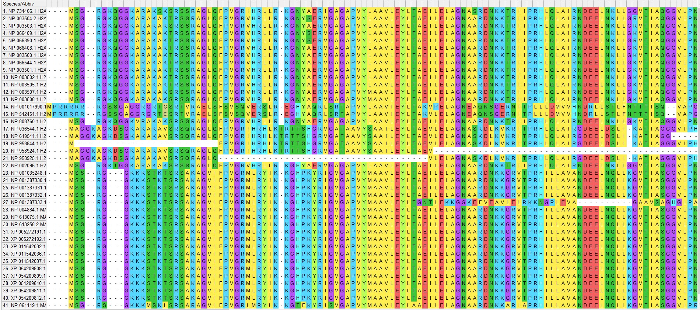
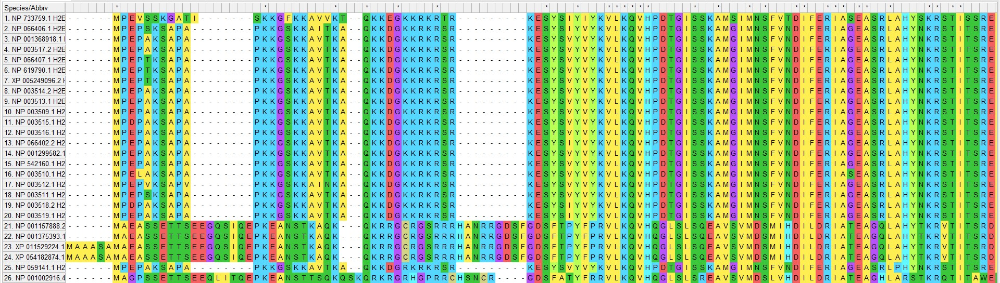
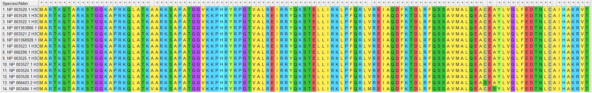
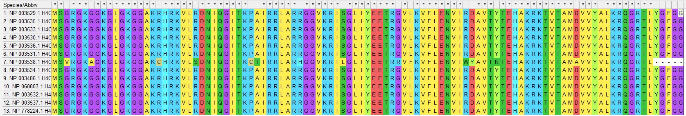
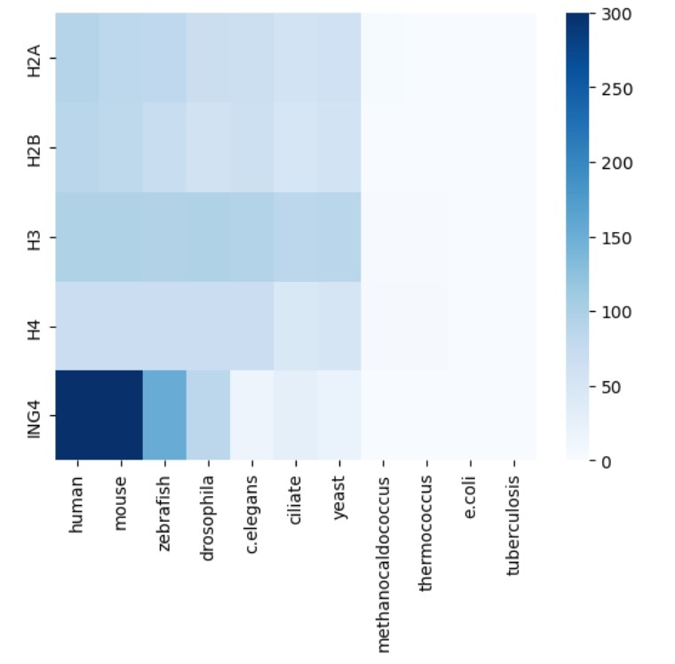

# Общее о ING4
Эпигенетическая функция:
1) Regulating cell proliferation in normal, non-transformed primary fibroblasts [Moreno, A., Soleto, I., García-Sanz, P. et al.] (https://doi.org/10.1038/onc.2013.145)
2) Regulating transcription through interactions with transcription factors such as HIF, NF-kB, and p53 (https://doi.org/10.1182/blood-2020-143388)

Входит в комплекс HBO1. Экспрессируется в мозге, щитовидной железе, матке. Наблюдаются домены ING_ING4, TNG2 super family.

# Выравнивание
|Название | Скриншот |
|:-:|:-:|
|H2A||
|H2B||
|H3||
|H4||

### Выравнивание в MEGAX алгоритмом MUSCLE со стандартными параметрами. В H3 и H4 последовательности почти одинаковы, в H2A и H2B различия сильнее.

# E-value (обрезка < 1e-300 и > 1)
|      |    human |    mouse |   zebrafish |   drosophila |   c.elegans |   ciliate |    yeast |   methanocaldococcus |   thermococcus |   e.coli |   tuberculosis |
|:-----|---------:|---------:|------------:|-------------:|------------:|----------:|---------:|---------------------:|---------------:|---------:|---------------:|
| H2A  | 4.94e-91 | 4.57e-84 |    1.06e-81 |     2.34e-69 |    6.53e-67 |  2.45e-57 | 8.88e-63 |             0.001    |       0.15     |      1   |          0.4   |
| H2B  | 2.85e-87 | 1.15e-83 |    1.85e-71 |     3.3e-59  |    5.28e-65 |  1.91e-49 | 3.07e-57 |             1        |       0.17     |      1   |          1     |
| H3   | 2.19e-96 | 1.54e-96 |    1.77e-95 |     9.39e-96 |    4.46e-94 |  8.41e-86 | 3.31e-87 |             0.034    |       0.057    |      0.9 |          1     |
| H4   | 1.09e-67 | 7.6e-68  |    1.13e-68 |     8.02e-68 |    6.15e-68 |  1.96e-45 | 1.08e-52 |             8.22e-05 |       3.31e-05 |      1   |          0.069 |
| ING4 | 1e-300   | 1e-300   |    4.29e-154   |     1.28e-85  |    1.12e-16 |  1.55e-29 | 1.42e-21 |             8.22e-05     |       3.31e-05     |      1   |          0.069     |

# -log(E_value)
|      |    human |    mouse |   zebrafish |   drosophila |   c.elegans |   ciliate |   yeast |   methanocaldococcus |   thermococcus |    e.coli |   tuberculosis |
|:-----|---------:|---------:|------------:|-------------:|------------:|----------:|--------:|---------------------:|---------------:|----------:|---------------:|
| H2A  |  90.3063 |  83.3401 |     80.9747 |      68.6308 |     66.1851 |  56.6108  | 62.0516 |            3         |       0.823909 | 0         |        0.39794 |
| H2B  |  86.5452 |  82.9393 |     70.7328 |      58.4815 |     64.2774 |  48.719   | 56.5129 |            0         |       0.769551 | 0         |        0       |
| H3   |  95.6596 |  95.8125 |     94.752  |      95.0273 |     93.3507 |  85.0752  | 86.4802 |            1.46852   |       1.24413  | 0.0457575 |        0       |
| H4   |  66.9626 |  67.1192 |     67.9469 |      67.0958 |     67.2111 |  44.7077  | 51.9666 |            4.08513   |       4.48017  | 0         |        1.16115 |
| ING4 | 300      | 300      |    153.3675 |      84.89279|    15.950782| 28.809668 |20.847712|            0.065502  |       0.638272 | 0.769551  |    0.522879    |

## ING4 эволюционно появился у позвоночных животных.
